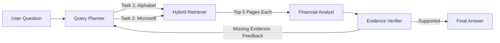

# FinSight — Enterprise Agentic Financial Research Assistant

FinSight is a production-grade Agentic AI application designed for deep financial research. It answers complex financial queries across multiple companies with traceable evidence, strict citations, and a robust self-correcting RAG pipeline.

## Problem

Financial analysts spend hours reading through lengthy 10-Ks and earnings reports, trying to extract specific metrics and qualitative assessments. Traditional keyword search is often insufficient for complex comparative queries (e.g., "Compare Microsoft and Alphabet's AI investment strategies"). Simple RAG "Chat with PDF" approaches often hallucinate financial figures, fail to synthesize cross-document information correctly, and split financial tables in half, leading to catastrophic data loss.

## Enterprise Agentic Architecture

FinSight solves this by implementing an Agentic Workflow using LangGraph, featuring a sophisticated Multi-Document RAG pipeline with verification loops:

1. **Multi-Task Query Planner:** Decomposes complex comparative questions into atomic, targeted retrieval tasks per company, dynamically injecting available database metadata to prevent entity mismatch.
2. **Hybrid Page-Level Retrieval:** Combines Semantic Vector Search (ChromaDB + SentenceTransformers) with Sparse Keyword Search (BM25) via an Ensemble framework. To prevent splitting financial tables, it employs Page-Level Chunking.
3. **Fair Reranking & Context Selection:** Executes retrieval independently per company and merges the results fairly (top-k per entity), ensuring no single company monopolizes the LLM context window. 
4. **Analyst Agent:** Analyzes the retrieved pages, extracts the data, and drafts the response strictly enforcing `[Filename, p. X]` citations.
5. **Self-Correcting Verification Loop:** An independent Verifier evaluates the Analyst's draft against the raw retrieved context. If evidence is missing or hallucinated, it returns a targeted feedback trace to the Planner, which generates alternative keywords (e.g., searching for "Statements of Income" instead of "Revenue") and triggers a completely new retrieval pass.

## Architecture



## Key Features Built

- **100% Free Tier API Support:** Optimized to run entirely on Groq's Free Tier using Llama 3/GPT open-source models, meticulously managing Tokens-Per-Minute (TPM) limits.
- **Document Deduplication:** SHA-256 hashing during ingestion to prevent duplicate vector entries.
- **Strict Metadata Filtering:** Forces exact matches on `company` and `year` to guarantee data integrity across multiple filings.
- **Diagnostics UI:** Real-time visibility into the agent's "brain", displaying retrieval attempt traces, query methods, candidate counts, and verification status.

## Screenshots

*(Placeholder for UI screenshots)*

## Technology Stack

- **Agent Orchestration:** LangGraph, LangChain
- **LLM:** Groq API (`openai/gpt-oss-120b`)
- **Vector Database:** ChromaDB
- **Hybrid Search:** `rank_bm25` (Sparse) + Dense Embeddings
- **Embeddings:** SentenceTransformers (`all-MiniLM-L6-v2`) (Local execution)
- **PDF Processing:** PyMuPDF
- **Frontend:** Streamlit

## Installation

### Prerequisites

- Python 3.11+
- Groq API Key (Free tier)

### Local Setup

1. Clone the repository:
   ```bash
   git clone <repo-url>
   cd finsight
   ```

2. Create a virtual environment and install dependencies:
   ```bash
   python -m venv venv
   source venv/bin/activate  # On Windows: venv\Scripts\activate
   pip install -r requirements.txt
   ```

3. Setup environment variables:
   ```bash
   cp .env.example .env
   # Edit .env and add your GROQ_API_KEY
   ```

### Docker Setup

```bash
docker-compose up --build
```

## Usage

1. Start the Streamlit app:
   ```bash
   streamlit run streamlit_app.py
   ```
2. Upload PDF financial reports (e.g., 10-K filings) via the sidebar. Enter the company name and year for proper metadata tagging.
3. Click "Process Documents".
4. Monitor the "Database Stats" panel to ensure documents are cleanly indexed.
5. Ask questions in the chat interface!

## Example Complex Queries

- "Compare revenue growth and margins for Microsoft and Alphabet in FY2024 and FY2023."
- "What are the biggest AI infrastructure risks management identifies in both companies?"

## Evaluation Methodology

The evaluation module tests the multi-document loop using `evaluation/test_multi_company.py` to ensure the system correctly isolates and retrieves from separate entities without hallucination.

To run tests:
```bash
python evaluation/test_multi_company.py
```

## Evaluation Results

*(Results will be populated after running the evaluation suite)*

## Limitations

- **Context Window:** Processing too many chunks simultaneously can overwhelm the context window.
- **Table Parsing:** PDFs with complex tabular data might not chunk perfectly without OCR/advanced table extraction.
- **Latency:** Agentic looping (Planner -> Analyst -> Verifier) increases response time compared to single-shot generation.

## Future Improvements

- Integrate PostgreSQL + pgvector for scalable vector search.
- Implement specialized table extraction (e.g., Unstructured.io).
- Add conversation memory windowing to prevent context overflow over long sessions.
