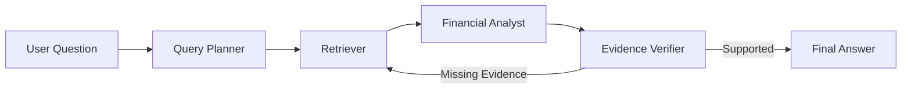

# FinSight — Agentic Financial Research Assistant

FinSight is a production-style agentic AI application for financial research, capable of answering complex financial questions across multiple companies with traceable evidence and citations.

## Problem

Financial analysts spend hours reading through lengthy 10-Ks and earnings reports, trying to extract specific metrics and qualitative assessments. Traditional keyword search is often insufficient for complex comparative queries (e.g., "Compare Microsoft and Alphabet's AI investment strategies"). Simple RAG "Chat with PDF" approaches often hallucinate financial figures or fail to synthesize cross-document information correctly.

## Why Agentic AI?

An agentic approach allows the system to:
1. **Plan:** Decompose a complex question into manageable retrieval tasks.
2. **Retrieve & Compute:** Extract evidence and use a calculator tool to compute ratios and growth (preventing LLM arithmetic hallucination).
3. **Verify:** Check the drafted answer against the original retrieved text, ensuring every claim is grounded. If claims are unsupported, the agent can loop back and try again.

## Architecture



## Example Workflow

1. **User asks:** "Compare revenue growth and margins for Microsoft."
2. **Planner:** Generates tasks to retrieve Microsoft's current and previous revenue and operating income.
3. **Retriever:** Fetches chunks containing the requested metrics.
4. **Analyst:** Uses the `financial_calculator` tool to correctly calculate the percentage growth and margins, and drafts a response with citations `[10-K, p. 45]`.
5. **Verifier:** Checks if the metrics cited actually exist in the retrieved chunks.
6. **Result:** Presented in the UI with an expandable "Agent reasoning flow".

## Screenshots

*(Placeholder for UI screenshots)*

## Technology Stack

- **Agent Orchestration:** LangGraph, LangChain
- **LLM:** Google Gemini / OpenAI GPT-4o (configurable)
- **Vector Database:** ChromaDB
- **Embeddings:** SentenceTransformers (`all-MiniLM-L6-v2`)
- **PDF Processing:** PyMuPDF
- **Frontend:** Streamlit
- **Validation:** Pydantic
- **Testing:** Pytest

## Installation

### Prerequisites

- Python 3.11+
- API Key for Google Gemini or OpenAI

### Local Setup

1. Clone the repository:
   ```bash
   git clone <repo-url>
   cd finsight
   ```

2. Create a virtual environment and install dependencies:
   ```bash
   python -m venv venv
   source venv/bin/activate  # On Windows: venv\Scripts\activate
   pip install -r requirements.txt
   ```

3. Setup environment variables:
   ```bash
   cp .env.example .env
   # Edit .env and add your API keys
   ```

### Docker Setup

```bash
docker-compose up --build
```

## Usage

1. Start the Streamlit app:
   ```bash
   streamlit run streamlit_app.py
   ```
2. Upload PDF financial reports (e.g., 10-K filings) via the sidebar. Enter the company name and year for proper metadata tagging.
3. Click "Process Documents".
4. Ask questions in the chat interface!

## Example Questions

- "Compare revenue growth between Microsoft and Alphabet."
- "What are the biggest risks management identifies?"
- "How has operating profitability evolved?"
- "Compare both companies’ AI strategy."

## Evaluation Methodology

The evaluation module runs a set of predefined questions against the agentic graph and scores the output based on:
1. **Retrieval Hit Rate:** Did the retriever fetch the right chunks?
2. **Groundedness / Faithfulness:** What percentage of important claims in the final answer were supported by the context, as judged by the Verifier?
3. **Answer Completeness:** (Heuristic based on expected facts).

To run evaluations:
```bash
python evaluation/evaluate.py
```

## Evaluation Results

*(Results will be populated after running the evaluation suite)*

## Limitations

- **Context Window:** Processing too many chunks simultaneously can overwhelm the context window.
- **Table Parsing:** PDFs with complex tabular data might not chunk perfectly without OCR/advanced table extraction.
- **Latency:** Agentic looping (Planner -> Analyst -> Verifier) increases response time compared to single-shot generation.

## Future Improvements

- Integrate PostgreSQL + pgvector for scalable vector search.
- Implement specialized table extraction (e.g., Unstructured.io).
- Add conversation memory windowing to prevent context overflow over long sessions.
